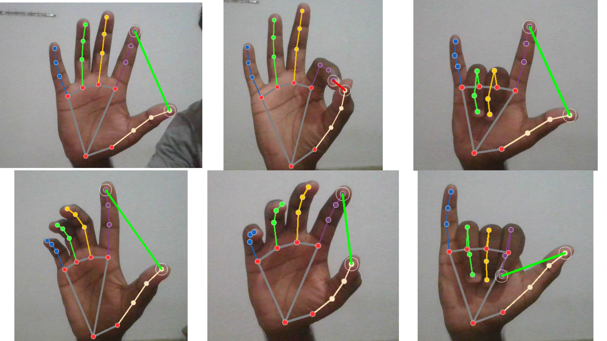

<div align="center">
  <h1>Hand Gesture Volume Control Using Python</h1>
 </div>
 
> This Project uses Python and some modules to control System Volume 

##  REQUIREMENTS
+ opencv-python
+ mediapipe
+ comtypes
+ numpy
+ pycaw

```bash
pip install -r requirements.txt
```
***
### OPENCV-PYTHON

OpenCV (Open Source Computer Vision Library) is an open-source computer vision and machine learning software library. It provides a common infrastructure for computer vision applications and accelerates the use of machine perception in commercial products. OpenCV was designed for computational efficiency and with a strong focus on real-time applications.

Key Features of OpenCV:
>Image Processing,Video Processing,Object Detection and Tracking, 2D Features Framework.


### MEDIAPIPE

Mediapipe is an open-source framework developed by Google that provides a comprehensive set of tools and solutions for building perception pipelines. It is designed to facilitate the development of machine learning applications that process live and static media data, such as videos and images. Mediapipe is particularly powerful for tasks that involve real-time processing on mobile devices, web, and desktops.

Key Features of Mediapipe:
>Initialize Mediapipe Hands Solution, Process Frames, Volume Control Logic and Display Results.


### COMTYPES

comtypes is a pure Python library that allows for the creation and management of COM (Component Object Model) objects. It provides a way to interact with COM interfaces and automate tasks in Windows applications. This is particularly useful for controlling system-level features like audio volume, which is where comtypes is used in conjunction with the pycaw (Python Core Audio Windows) library to control system audio settings.

Key Features of Comtypes:
>Initialize Audio Interface, Capture Video and Detect Hand Gestures and Map Gestures to Volume Control.


### NUMPY

NumPy (Numerical Python) is a fundamental package for scientific computing in Python. It provides support for arrays, matrices, and a large collection of mathematical functions to operate on these data structures efficiently. In the context of a hand gesture volume controller, NumPy is used to perform mathematical operations that facilitate the detection and interpretation of hand gestures.

Key Features of Numpy:
>Calculate Distances and Map Distances to Volume Levels.


### PYCAW

pycaw (Python Core Audio Windows) is a Python library that provides access to Windows Core Audio APIs, allowing you to control audio settings on Windows. It is especially useful for tasks like adjusting the system volume, muting audio, and retrieving audio device information. In the context of a hand gesture volume controller, pycaw enables you to change the system volume based on hand gestures detected by a webcam.

Key Features of Pycaw:
>Access Audio Devices and Integration with Other Libraries.

***
### Gestures info

Hand Landmarks:

<div align="center">
        
</div>
Hand Gestures:

<div align="center">
    
</div>

<br>


##  CODE EXPLANATION
<b>Importing Libraries</b>
```py
import cv2
import mediapipe as mp
import math
import numpy as np
from ctypes import cast, POINTER
from comtypes import CLSCTX_ALL
from pycaw.pycaw import AudioUtilities, IAudioEndpointVolume
```
***
Initialize MediaPipe drawing utilities, drawing styles, and hands model
```py
mp_drawing = mp.solutions.drawing_utils
mp_drawing_styles = mp.solutions.drawing_styles
mp_hands = mp.solutions.hands
```
***

Volume Control Library Setup
```py

devices = AudioUtilities.GetSpeakers()
interface = devices.Activate(IAudioEndpointVolume._iid_, CLSCTX_ALL, None)
volume = cast(interface, POINTER(IAudioEndpointVolume))
volRange = volume.GetVolumeRange()
minVol, maxVol = volRange[0], volRange[1]  # Extract the minimum and maximum volume levels
volBar, volPer = 400, 0  # Initialize the volume bar and volume percentage
```
***
Start capturing video from the webcam
```py
wCam, hCam = 640, 480  # Set the width and height for the webcam
cam = cv2.VideoCapture(0)  # Open the default camera (0)
cam.set(3, wCam)  # Set the width
cam.set(4, hCam)  # Set the height
```
***
Use the MediaPipe Hands model
```py
with mp_hands.Hands(
    model_complexity=0,
    min_detection_confidence=0.5,  # Minimum detection confidence
    min_tracking_confidence=0.5  # Minimum tracking confidence
) as hands:

    while cam.isOpened():
        success, image = cam.read()  # Read a frame from the webcam
        if not success:
            break

        image = cv2.cvtColor(image, cv2.COLOR_BGR2RGB)  # Convert the image to RGB
        results = hands.process(image)  # Process the image and detect hands
        image = cv2.cvtColor(image, cv2.COLOR_RGB2BGR)  # Convert the image back to BGR

        if results.multi_hand_landmarks:
            for hand_landmarks in results.multi_hand_landmarks:
                mp_drawing.draw_landmarks(
                    image,
                    hand_landmarks,
                    mp_hands.HAND_CONNECTIONS,  # Draw hand connections
                    mp_drawing_styles.get_default_hand_landmarks_style(),  # Use default hand landmark style
                    mp_drawing_styles.get_default_hand_connections_style()  # Use default hand connections style
                )
```
***
Finding the position of hand landmarks
```py
lmList = []
        if results.multi_hand_landmarks:
            myHand = results.multi_hand_landmarks[0]  # Get the first detected hand
            for id, lm in enumerate(myHand.landmark):
                h, w, c = image.shape  # Get image dimensions
                cx, cy = int(lm.x * w), int(lm.y * h)  # Convert normalized coordinates to pixel values
                lmList.append([id, cx, cy])  # Append to the landmarks list    
```
***
Assigning variables for thumb and index finger positions
```py
if len(lmList) != 0:
            x1, y1 = lmList[4][1], lmList[4][2]  # Thumb tip position
            x2, y2 = lmList[8][1], lmList[8][2]  # Index finger tip position
```
***
Marking thumb and index finger
```py
cv2.circle(image, (x1, y1), 15, (255, 255, 255))
            cv2.circle(image, (x2, y2), 15, (255, 255, 255))
            cv2.line(image, (x1, y1), (x2, y2), (0, 255, 0), 3)
            length = math.hypot(x2 - x1, y2 - y1)  # Calculate the distance between thumb and index finger
            if length < 50:
                cv2.line(image, (x1, y1), (x2, y2), (0, 0, 255), 3)  # Change the line color to red
```
***
Converting Length range into Volume range
```py
vol = np.interp(length, [50, 220], [minVol, maxVol])
            volume.SetMasterVolumeLevel(vol, None)
            volBar = np.interp(length, [50, 220], [400, 150])  # Map the distance to the volume bar position
            volPer = np.interp(length, [50, 220], [0, 100])  # Map the distance to volume percentage
```
***
Volume Bar using cv2.rectangle()
```py
cv2.rectangle(image, (50, 150), (85, 400), (0, 0, 0), 3)  # Draw the volume bar outline
            cv2.rectangle(image, (50, int(volBar)), (85, 400), (0, 0, 0), cv2.FILLED)  # Fill the volume bar
            cv2.putText(image, f'{int(volPer)} %', (40, 450), cv2.FONT_HERSHEY_COMPLEX,
                        1, (0, 0, 0), 3)

```
***
Showing result using cs2.imshow()
```py
cv2.imshow('HandDetector', image)  # Show the image
        if cv2.waitKey(1) & 0xFF == 27:  # press Ecs key to exit
            break
```
***
Closing webCam
```py
cam.release()
cv2.destroyAllWindows()
```
***

Result
<div align="center">
  
 </div>
 
***

<div align = "center">
    <h2>THANK YOU 🙏</h2>
</div>
